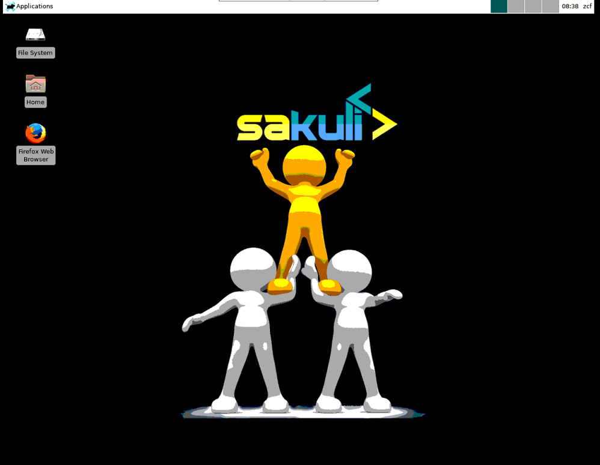

# Singularity VNC Container

This singularity vnc containers are originally from  [Consol Docker container](https://github.com/ConSol/docker-headless-vnc-container) , and change it so that it can be used in multi-tenant HPC  and AI environment.


The container image is installed with the following components:

* Desktop environment [**Xfce4**](http://www.xfce.org) 
* VNC-Server 
* [**noVNC**](https://github.com/novnc/noVNC) - HTML5 VNC client 
* Browsers:
  * Mozilla Firefox
  

## Usage 
- Git clone this project

- Build container

  ```
  cd singularityvnc
  singularity build centosvnc.sif  centos-xfce-vnc.simg
  ```

- Singularity shell to check the help

  ```
  singularity shell centosvnc.sif 
  Singularity centosvnc.sif:~> cd /opt
  Singularity centosvnc.sif:/opt> ./vnc_startup.sh -h
  
  USAGE: ./vnc_startup.sh VNC_PORT:5901 VNC_PW:Passw0rd NO_VNC_PORT:6901
  
  VNC_PORT is must have.
  VNC_PW is needed when you first time to run a vnc or you want to overwrite the previous settting.
  NO_VNC_PORT should be provided when you need use novnc.
  
  ```

- Launch VNC

      Singularity centosvnc.sif:/opt> ./vnc_startup.sh VNC_PORT:5901 VNC_PW:Passw0rd
      VNC_PORT:5901
      VNC_PW:***
      NO_VNC_PORT
      the vnc scripts files are already existing
      
      ------------------ change VNC password  ------------------
      
      ---------  purging existing VNC password settings  ---------
      
      ------------------ start VNC server ------------------------
      remove old vnc locks to be a reattachable container
      start vncserver with param: VNC_COL_DEPTH=24, VNC_RESOLUTION=1280x1024
      ...
      start window manager
      ...
      
      VNCSERVER started on DISPLAY= :1
              => connect via VNC viewer with 10.240.208.106:5901

* Access through vncviewer

  

  Note: If you want to **access the vnc through web browser**,  when you run ./vnc_startup.sh, you should provide the **NO_VNC_PORT:6901**.

## Usage with Scheduler

This will show how to use the container with HPC/AI scheduler, the below will take the scheduler slurm as example.

- Create one slurm job file, such as job.slurm, the below is the content:
 
  the below example assuming the current use is zcf, the home directory of user zcf is /home/zcf/, if you want to use the pycharm in the vnc, you need download the pycharm package from pycharm website, and put the pycharm package under user's home directory /home/zcf, in the vnc, you will be able to see the pycharm package and use it 
  ```
  #!/bin/bash
  #SBATCH --job-name='test'
  #SBATCH --partition=compute
  #SBATCH --nodes=1
  #SBATCH --mincpus=8
  
  singularity exec /home/zcf/centosvnc.sif /opt/vnc_startup.sh VNC_PORT:5901 VNC_PW:Passw0rd
  ```


- Submit job:

  ```
  sbatch job.slurm
  ```
  After submitting job, the job output will show which server the vnc is running on, then you can access that node with the vnc_port set in the job file. 
  
